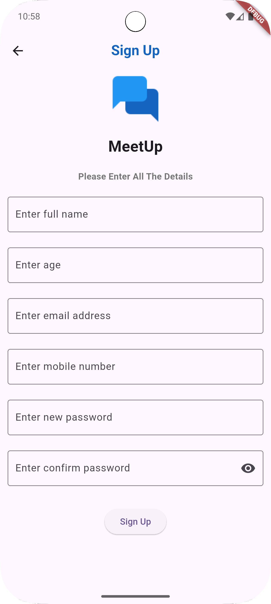

# 💬 Flutter Chat App

A real-time, scalable, and cleanly architected **One-to-One Chat App** built with **Flutter**, **BLoC pattern**, and **Firebase**. 
The app supports secure user authentication, instant messaging, image sharing, and cloud persistence — all wrapped in a polished, responsive user interface.

## ✨ Features

✅ User Registration & Login (Email/Password)  
✅ Real-time Chat using Cloud Firestore  
✅ Image Upload (Camera/Gallery) with Firebase Storage  
✅ Online/Offline User Presence  
✅ Timestamp and Chat History  
✅ BLoC for State Management  
✅ Clean and Scalable Architecture  
✅ Fully Responsive UI for Android & iOS

## Screenshots

**Login Screen:**

**SignUp Screen:**

**Chat List Screen:**

**Chat Conversation Screen:**

**Chat Conversation Screen:**

**Status Screen:**

**Buddies Screen:**

**Settings Screen:**

---

## 🧰 Tech Stack

| Technology       | Usage                |
|------------------|----------------------|
| Flutter          | UI Framework         |
| BLoC             | State Management     |
| Firebase Auth    | User Authentication  |
| Cloud Firestore  | Real-Time Database   |
| Firebase Storage | File/Image Uploads   |
| Dart             | Programming Language |

---

## Contributing

If you're open to contributions, provide guidelines here.

1. Fork the repository.
2. Create a new branch (`git checkout -b feature/your-feature`).
3. Make your changes and commit them (`git commit -m 'feat: Add your feature'`).
4. Push to the branch (`git push origin feature/your-feature`).
5. Create a Pull Request.

## Contact

How people can get in touch with you.

* Your Name - Ankush Gaur
* Project Link: https://github.com/AnkushGaur999/MeetUp